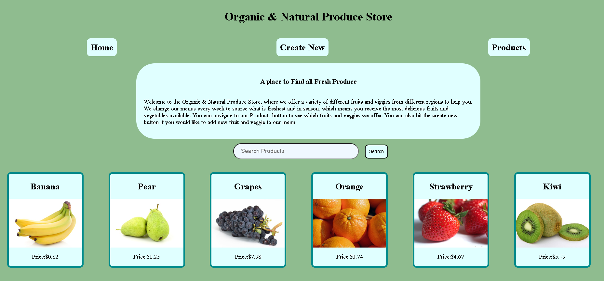

# Organic & Natural Produce Store
### By: Sarika Rajpure
## Motivation

My motivation for this store is to bring everyone together while they explore different fresh and organic produce across the globe. This web app is useful for suppliers to create and list a product on my website. So, potential costumers can buy products from my site.

### Youtube link 
[Youtube](https://youtu.be/)
### Github link 
[Organic & Natural Produce Store](https://github.com/SarikaRAJPURE/ProductStore.git)

### THE STORE 

The Store was a concept inspired by my family who always looked for Organic Fresh Produce and friends who are local producers. Considering everyone these days look for Organic Fresh Produce , I wanted to create a store that would bring all of them together and help each other. 

### Pages

1. HOME page:

- Home page has a navigation bar at the top.
- Home page also has a search bar to search product and which will get redirected to the that products page.

- all the products are displayed here.

-the images link to the PRODUCT's Detail page

2. Create New page:

- allows for creation of new products (users will include a URL for the image)

3. Product Details Page:

- Shows specific product and it’s details
- Has a link back to the HOME page.
- a link to edit the product (goes to the edit page)
- a delete button that deletes
- user can also search for a specific product from this page
- Clicking buy button should lower remaining by 1
- If the quantity of your item is zero, the show page should say 'OUT OF STOCK' instead of saying how many are remaining. (Hint: conditionals).
-The BUY button gets disabled if the quantity of the item is zero

4. Products Page:

- which gives list of all products along with a status of inventory.
-  if product is in stock its highlighted in green and if it is out of stock it's highlighted in red.

4. Edit Page:

- allow user to edit the data of a specific product (using it’s product ID)

## Technologies Used
- HTML
- CSS
- Java Script
- Express
- MongoDB
- Mongoose
- React
- Github

## Acknowledgements

These are all the resources I used to help me create my final Store. 

- [w3Schools](https://www.w3schools.com/default.asp)
- [MDN](https://developer.mozilla.org/en-US/)
- [Stack Overflow](https://stackoverflow.com/questions/4747520/simple-css-form-layout)

